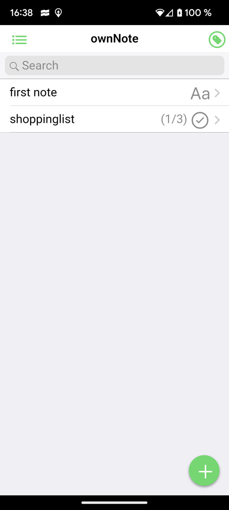
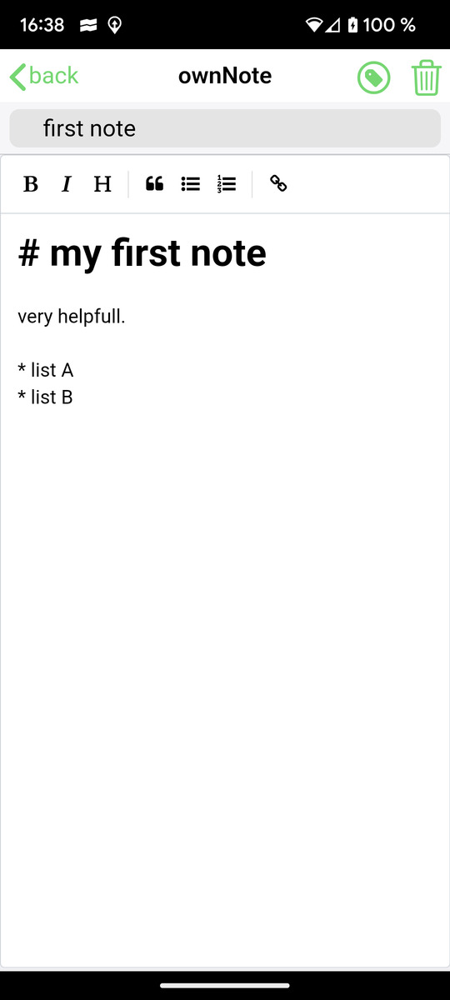
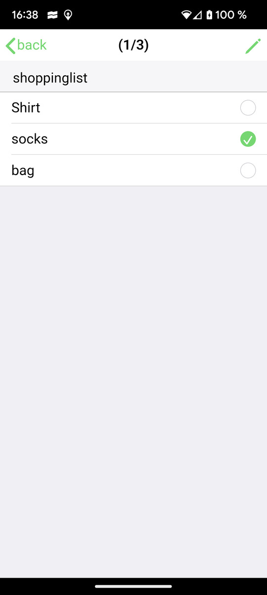
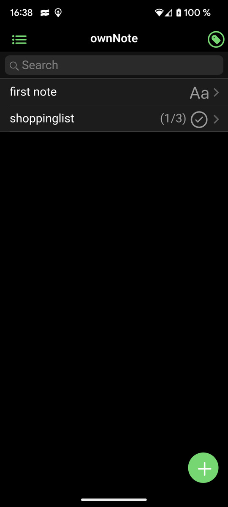

# ownNote

## Streamline tasks with notes & checklists.

Introducing **ownNote**: Your Private Note-Taking and Checklist App

Are you tired of apps that compromise your privacy, bombard you with ads, or lack the features you need? Look no further than ownNote, the note-taking and checklist app designed with you in mind. ownNote offers a clean, intuitive interface combined with a range of powerful features that enhance your note-taking and task management experience.

**Key Features:**

**1. No Cloud Storage:**
- We prioritize your privacy. ownNote does not store your notes and checklists on external servers. Your data remains securely on your device, ensuring your sensitive information stays private and under your control.

**2. Ad-Free Experience:**
- Say goodbye to annoying ads that disrupt your workflow and compromise your focus. ownNote is completely ad-free, providing a distraction-free environment for your productivity.

**3. Markdown Editor:**
- Unlock advanced text formatting with our built-in Markdown editor. Style your notes with headings, lists, links, and more, all with simple and intuitive syntax.

**4. Checklists:**
- Stay organized with ease by creating to-do lists and checklists. Track your tasks and mark them as completed, helping you manage your responsibilities efficiently.

**5. Categories:**
- Organize your notes and checklists effortlessly using customizable categories. Keep your content neatly sorted, making it a breeze to find what you need when you need it.

**6. Color Themes:**
- Personalize your ownNote experience with a wide selection of color themes. Choose the one that suits your mood or enhances your productivity, creating a visually appealing workspace.

**7. Light Mode and Dark Mode:**
- Whether you prefer a bright, refreshing interface or a more relaxed, dark ambiance, ownNote offers both light and dark modes. Switch between them at any time to reduce eye strain and adapt to different lighting conditions.

**8. Intuitive User Interface:**
- ownNote features a clean and user-friendly interface designed for seamless navigation. Enjoy a clutter-free environment that keeps your focus on what matters most—your notes and checklists.

**9. Data Security:**
- We take your data security seriously. Your information is stored locally on your device, safeguarding your privacy and sensitive content.

**10. Regular Updates:**
- We're dedicated to improving your experience. Expect regular updates that enhance functionality, fix bugs, and introduce new features based on user feedback.

Say hello to a new era of efficient note-taking and task management. ownNote combines privacy, functionality, and customization to help you capture ideas, plan tasks, and streamline your life. Download ownNote today and take control of your notes and checklists like never before.

Experience the difference with ownNote—where your data stays yours, your focus remains uninterrupted, and your productivity soars. Welcome to a clutter-free, ad-free, and private note-taking experience that's tailored to you.

## all notes and checklists

## markdown-editor to write notes

## view notes in different font-sizes

## work with checklists

## darkmode

# web-version

https://www.mad5.de/ownnote/

# android-App

wrapped into an android-app:

[https://play.google.com/store/apps/details?id=de.mad5.ownnote](https://play.google.com/store/apps/details?id=de.mad5.ownnote)